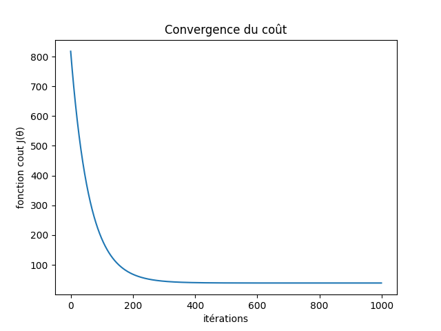
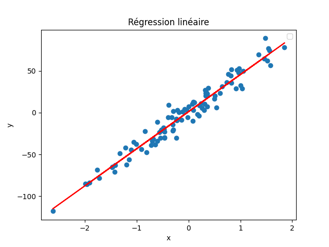
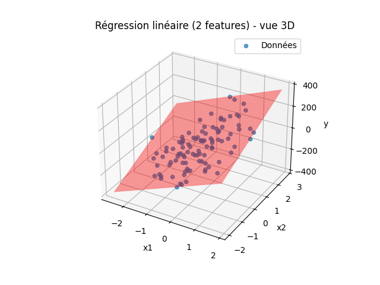
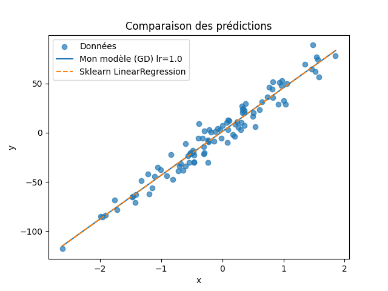
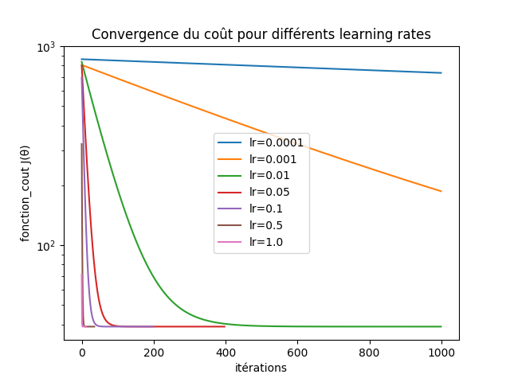

# Machine Learning Niveau 1 – Régression Linéaire en Python

## Présentation du projet

Ce projet représente ma première étape d'apprentissage en Machine Learning.

Tout a été entièrement implémenté en **Python**, en utilisant NumPy pour les calculs matriciels et Matplotlib pour la visualisation.  
L’objectif n’était pas simplement d’utiliser des bibliothèques de machine learning, mais de comprendre en profondeur le fonctionnement mathématique et algorithmique de la régression linéaire.

À travers ce projet, je me suis concentré sur :

- La formulation matricielle du modèle
- L’implémentation manuelle de la descente de gradient
- La minimisation de la fonction de coût
- Le calcul manuel du coefficient de détermination R²
- Le feature engineering polynomial
- La comparaison avec Scikit-Learn

Tous les modèles ont d’abord été implémentés manuellement et entièrement en python avant d’être comparés à des outils optimisés.  
Pour obtenir toutes les informations (temps d’exécution, convergence, métriques), il est nécessaire d’exécuter les programmes.  
Les datasets sont générés aléatoirement à l’aide d’une bibliothèque, mais il est possible d’utiliser vos propres données si vous le souhaitez.

---

## Formulation Mathématique

### Hypothèse du modèle

Le modèle de régression est exprimé sous forme matricielle :

$$
\hat{y} = X\theta
$$

Où :

- $X \in \mathbb{R}^{m \times n}$ est la matrice de design  
- $\theta \in \mathbb{R}^{n \times 1}$ est le vecteur des paramètres  
- $m$ est le nombre d’échantillons  

Le terme de biais est pris en compte en ajoutant une colonne de 1 à la matrice $X$.

---

### Fonction de coût

La fonction de coût implémentée en Python est :

$$
J(\theta) = \frac{1}{2m}(X\theta - y)^T (X\theta - y)
$$

Cette formulation permet une implémentation entièrement vectorisée sans boucle.

---

### Gradient

Le gradient utilisé dans la descente de gradient est :

$$
\nabla J(\theta) = \frac{1}{m} X^T (X\theta - y)
$$

---

### Règle de mise à jour

$$
\theta := \theta - \alpha \nabla J(\theta)
$$

Où $\alpha$ représente le learning rate.

Tous les calculs sont effectués à l’aide des opérations matricielles de NumPy.

---

## 1. Régression Linéaire Unidimensionnelle

**Fichier :** [MLregressionlinunidim.py](MLregressionlinunidim.py)

Modèle :

$$
\hat{y} = \theta_1 x + \theta_0
$$

Dans cette implémentation :

- Les paramètres sont initialisés aléatoirement
- Le coût est enregistré à chaque itération
- La convergence est visualisée
- Le coefficient R² est calculé manuellement :

$$
R^2 = 1 - \frac{\sum (y - \hat{y})^2}{\sum (y - \bar{y})^2}
$$

### Convergence du coût

### Résultat de la régression

---

## 2. Régression Linéaire Multidimensionnelle (2 features)

**Fichier :** [MLregressionlinmultidim3D.py](MLregressionlinmultidim3D.py)

Modèle :

$$
\hat{y} = \theta_1 x_1 + \theta_2 x_2 + \theta_0
$$

La matrice de design est construite comme suit :

$$
X =
\begin{pmatrix}
x_{11} & x_{12} & 1 \\
x_{21} & x_{22} & 1 \\
\vdots & \vdots & \vdots
\end{pmatrix}
$$

Cette partie met en évidence :

- Le calcul vectorisé du gradient
- La visualisation 3D du plan de régression
- L’évaluation manuelle des performances

### Plan de régression 3D

---

## 3. Régression Non Linéaire (Feature Engineering Polynomial)

**Fichier :** [MLregressionnonlin.py](MLregressionnonlin.py)

Pour modéliser des relations non linéaires, une feature polynomiale est introduite :

$$
x' = x^2
$$

La nouvelle matrice de design devient :

$$
X =
\begin{pmatrix}
x_1^2 & x_1 & 1 \\
x_2^2 & x_2 & 1 \\
\vdots & \vdots & \vdots
\end{pmatrix}
$$

Le modèle reste linéaire en paramètres :

$$
\hat{y} = \theta_2 x^2 + \theta_1 x + \theta_0
$$

### Résultat de la régression non linéaire

---

## 4. Comparaison : Descente de Gradient personnalisée vs Scikit-Learn

**Fichier :** [comparaisonRLvsRLopti.py](comparaisonRLvsRLopti.py)

Dans cette partie, je compare :

- Mon implémentation personnelle de la descente de gradient
- `sklearn.linear_model.LinearRegression`

La comparaison porte sur :

- Le temps d’exécution
- Le coût final
- L’erreur quadratique moyenne (MSE)
- Le score R²
- La stabilité selon différents learning rate

### Convergence pour différents learning rates

Cela montre clairement la sensibilité de la descente de gradient au choix du learning rate.

### Comparaison des prédictions

Lorsqu’il est correctement paramétré, mon modèle converge vers des prédictions pratiquement identiques à celles de Scikit-Learn.

---

## Technologies utilisées

- Python
- NumPy
- Matplotlib
- Scikit-Learn (utilisé uniquement pour la comparaison)

